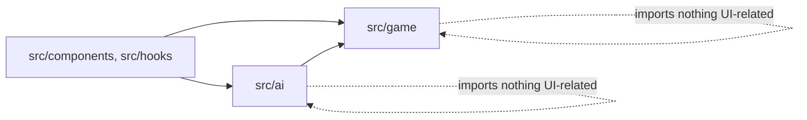

# Architecture

Splendor is a pure-frontend SPA. No backend, no database, no auth. All game logic and AI run in the browser.

## Module boundaries

### `src/game/` — pure game engine

- `types.ts` — Card, Noble, Gem, Player, GameState, Move
- `constants.ts` — full card deck data, noble tiles
- `engine.ts` — rules: move validation, state transitions, win detection
- `moves.ts` — move generation: all legal moves from a given state

**Invariant:** never imports from React or any UI library. Pure TypeScript.

### `src/ai/` — AI strategies

All implement the same `AIStrategy` interface: `(state, playerIndex) => Move`.

- `random.ts` — picks a random legal move (baseline)
- `greedy.ts` — score-maximizing heuristic, one move ahead
- `mcts.ts` — Monte Carlo Tree Search

**Invariant:** never imports from React or any UI library. Pure TypeScript.

### `src/components/`, `src/hooks/` — React UI

The only place React lives. Imports from `src/game/` and `src/ai/` to render state and invoke AI.

## AI learning progression

1. **Random** — establish baseline, verify move generation is correct
2. **Greedy** — score-maximizing heuristic, teaches evaluation functions
3. **MCTS** — Monte Carlo Tree Search, the standard for modern board game AI

The repo's value isn't the game — it's the implementation gradient of board-game AI.